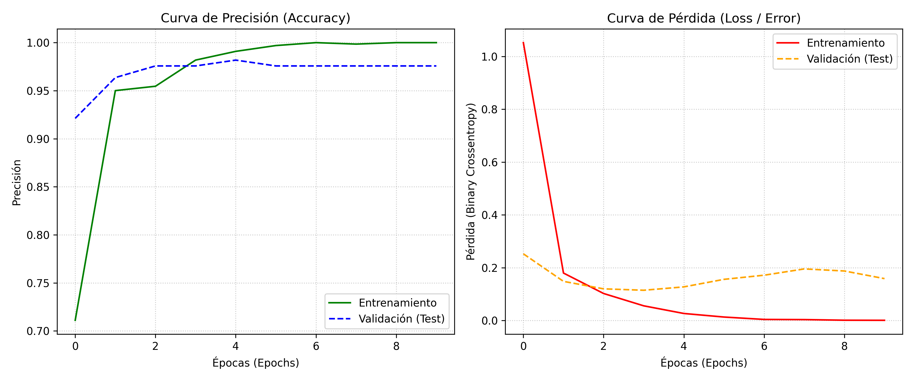

# DO YOU TENSORFLOW? — Ves lo que veo 👁️🤖
## IUJO — Feria de Haceres Período I-2026
### Unidad Curricular: INO-544 (Investigación de Operaciones)

---

## 👥 Integrantes y Roles
* **Integrante 1:** Jerson Orozco - [31549760] - *Rol: Ingeniero de Datos (Dataset y Preprocesamiento)*
* **Integrante 2:** Johnder Marcano - [31.155.486] - *Rol: Arquitecto de IA (Modelado y Entrenamiento)*
* **Integrante 3:** Santiago Peña - [31127028] - *Rol: Ingeniero de Despliegue (Exportación ONNX y Pruebas)*
* **Integrante 4:** Ayleen Betancourt - [31367339] - *Rol: Documentación y Requerimientos*

---

## 🎯 1. Clase/Tema Seleccionado
* **Tema asignado:** Plantas Naturales
* **Descripción del Objeto:** Estructuras orgánicas botánicas, identificadas mediante la extracción de características visuales (bordes de hojas, texturas, pigmentación verde) diferenciándolas de objetos de control y falsos positivos (Hard Negatives).

---

## 📊 2. Gestión del Dataset (Ingeniería de Datos)
* **Cantidad de imágenes originales recopiladas:** 826 imágenes en total (388 de "Plantas Naturales" y 438 de "No Planta" / Hard Negatives).
* **Estrategia de Data Augmentation y Preprocesamiento aplicada:**
    * *Rescaling:* Normalización de píxeles a escala `1./255` directamente en la capa de entrada de la red.
    * *Hard Negatives:* En lugar de aplicar rotaciones o zoom sintético, se optó por una recolección manual intensiva de "falsos positivos" (objetos verdes artificiales, sillas, envases) para forzar a la red a no depender de la pigmentación, sino de la estructura orgánica.
* **Total de imágenes generadas para el entrenamiento:** 661 imágenes (80%) para entrenamiento y 165 imágenes (20%) para validación/testing.
* **Resolución y formato estandarizado:** 224x224 píxeles, canales RGB (Formato Tensor: `[1, 224, 224, 3]`).

---

## 🧠 3. Arquitectura del Modelo y Entrenamiento
* **Framework utilizado:** TensorFlow/Keras
* **Descripción de la Red (CNN):** Arquitectura secuencial compuesta por 2 capas convolucionales (Conv2D de 32 y 64 filtros) intercaladas con capas MaxPooling2D, seguidas de una capa Flatten y una capa Densa oculta de 64 neuronas.
* **Hiperparámetros óptimos seleccionados:**
    * *Función de pérdida (Loss):* Binary Crossentropy
    * *Optimizador:* Adam
    * *Tasa de Aprendizaje (Learning Rate):* 0.001 (Por defecto de Adam)
    * *Épocas (Epochs):* 10
    * *Tamaño de lote (Batch Size):* 32

### 💡 Justificación Crítica (Control de Autoría)
*Explique detalladamente por qué el equipo eligió esa Tasa de Aprendizaje (Learning Rate) específica y el impacto que tuvo en las gráficas de pérdida durante el laboratorio:*
>Para el modelo, nos fuimos por un Learning Rate de 0.001 con el optimizador Adam, básicamente porque necesitábamos que el entrenamiento fuera estable pero sin quedarse estancado. Nuestro dataset tiene su complicación, sobre todo por unas 438 imágenes que son súper engañosas y confunden al modelo. Si le poníamos una tasa de aprendizaje más alta, la gráfica de pérdida se iba a volver loca con oscilaciones violentas y habríamos borrado los patrones botánicos que la red ya había aprendido. Con 0.001 logramos que la pérdida bajara rápido y suave, sin meterle sobreajuste antes de la época 10.

---

## 📈 4. Métricas de Rendimiento (Testing - 20%)
* **Precisión final (Accuracy) en la data de test:** ~ 97.55%
* **Pérdida final (Loss) en la data de test:** ~ 0.0787

*(Gráfica de entrenamiento Accuracy/Loss del modelo generada por el equipo)*


---

## ⚙️ 5. Especificación de Exportación ONNX
El modelo se ha homologado bajo los estándares requeridos por la interfaz centralizada:
* **Nombre del archivo:** `model/modelo_plantas.onnx`
* **Tensor de Entrada (Input Shape):** `[1, 224, 224, 3]` (Tipo: `float32`)
* **Tensor de Salida (Output Shape):** `[1, 1]` (Tipo: `float32`)
* **Función de activación final:** Sigmoide (Rango de salida de 0.0 a 1.0 para conversión a porcentaje).

---

## 🚀 6. Instrucciones de Ejecución Local
Para replicar el despliegue del modelo y la interfaz:

1. Clonar el repositorio:
   bash
   git clone [https://github.com/JohnderMarcano/INO544-2026I-PlantasNaturales.git]

2.Acceder al directorio:
   bash
    cd INO544-2026I-PlantasNaturales

3. Instalar las dependencias requeridas:
   bash
    pip install -r requirements.txt

4. Ejecutar la interfaz de usuario:
    ```bash
    streamlit run app.py 


